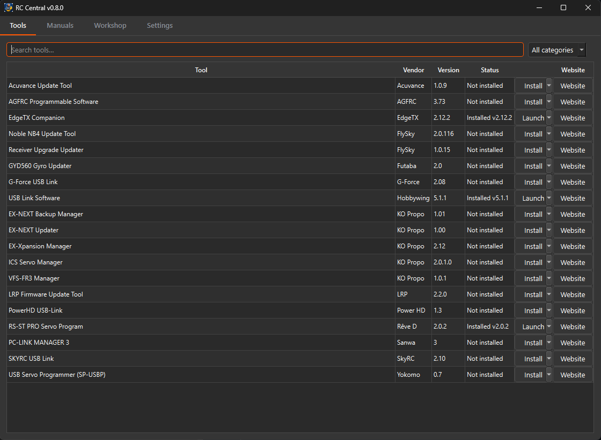
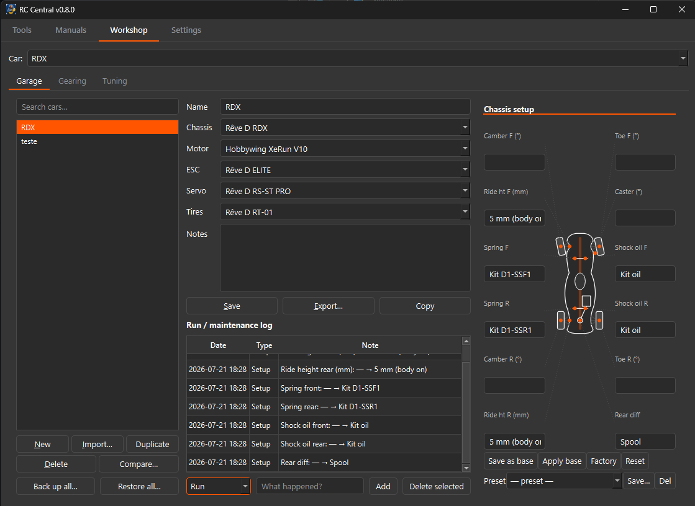

# RC Central

[](https://github.com/J3vb/RC-Central/actions/workflows/build.yml)
[](https://github.com/J3vb/RC-Central/releases/latest)


[](LICENSE)

One desktop app to install and launch all your radio-controlled (RC) drift car
setup tools — servo programmers, ESC configuration software, and radio
utilities. Pick a tool from the catalog, click Install, click Launch. No hunting
through vendor download pages. It also bundles a gearing calculator, a drift
tuning guide, and a car garage for tracking your setups.





**Status: beta.** The catalog covers 32 entries: 17 installable tools — servo
programmers (Rêve D, AGFRC, KO Propo, Yokomo), ESC suites (Hobbywing, SkyRC,
Acuvance, G-Force, KO Propo), gyro (Futaba GYD560) and radio tools (FlySky,
EdgeTX Companion, Sanwa, KO Propo EX-NEXT / EX-RR) — plus 15 reference cards
for drift gear that has no PC software at all, covering servos and gyros
(Sanwa PGS and SGS-02, Futaba GYD550, Yokomo DP-302, SRT D1S, Rêve D REVOX,
Onisiki) and chassis build manuals (Yokomo YD-2/SD/RD, MST RMX/FXX, Overdose
GALM/Divall, Rêve D RDX, Onisiki Kodama).

## How it works

RC Central never re-hosts vendor software. The catalog is a set of JSON
manifests pointing at each vendor's **official** download URL. The app downloads
straight from the vendor, unzips to the per-user data directory
(`%LOCALAPPDATA%\RCCentral\tools\` on Windows, `~/.local/share/RCCentral/tools/`
on Linux), and launches the tool — the same model as Ninite and Scoop.

Already have a tool downloaded? Use the action button's dropdown →
**Locate existing install…**, point it at the exe, and enter the version — RC
Central tracks and launches your copy without re-downloading it.

## Beyond the launcher

- **Manuals** — official manual and support links for every catalog entry,
  cross-platform, including chassis build guides for the common drift kits.
- **Workshop** — Garage, Gearing, and Tuning in one tab, all sharing the active
  car picked in its header:
  - **Garage** — car profiles with specs, gearing, and a setup log; compare two
    cars side by side, named gearing presets, JSON import/export, one-click
    backup/restore.
  - **Gearing** — rollout/ratio math, reverse solve (target rollout or target
    FDR → pinion), an inline gear-ratio chart, and a pinion what-if table.
  - **Tuning** — drift chassis tuning chart with per-setting explainers, a
    shock-oil conversion table, a gyro guide, and a per-car tuning log.
- **Self-update** — checks GitHub Releases on startup (toggle in Settings)
  and swaps in the new build on exit.
- **Dark & light themes** and a built-in log viewer, under the **Settings** tab.

## Supported platforms

Prebuilt binaries are released for **Windows x64**, **Windows ARM64**, and
**Linux x64**. The Workshop (Garage, Gearing, Tuning) and Manuals are fully
cross-platform; the **Tools** tab (which installs and launches vendor programmer
software) is Windows-only, since that software ships as Windows executables — on
Windows on ARM they run under the OS's x86/x64 emulation. On Linux the Tools tab
is hidden and RC Central is the Workshop and Manuals.

## Download

Grab the latest binary from the
[releases page](https://github.com/J3vb/RC-Central/releases/latest) — pick
`RCCentral-windows-x64.exe` unless you know you have an ARM64 machine. There's
no installer; it's a single exe you can put wherever you like and delete when
you're done.

**Windows will warn you the first time.** You'll see *"Windows protected your
PC"* — click **More info** → **Run anyway**. That warning means the app isn't
signed with a paid code-signing certificate, not that anything is wrong with it.
Certificates cost a few hundred dollars a year, which is hard to justify for a
free hobby project until it has more users. Every release is built in public by
[GitHub Actions](.github/workflows/build.yml) from the source in this repo, so
you can read exactly what went into the binary you're running.

If you'd rather verify than trust, every release ships a `.sha256` next to each
binary:

```powershell
certutil -hashfile RCCentral-windows-x64.exe SHA256
```

Compare that against the matching `.sha256` file. Releases also carry an Ed25519
`.sig`, which the app checks automatically before it ever applies an update to
itself.

## Run from source

```sh
uv sync
uv run python -m app.main
```

Tests: `uv run pytest`

## Adding a tool to the catalog

1. Copy `catalog/tools/reved-rs-st-pro.json` as a template.
2. Fill in the vendor's official download URL (never a mirror), version, and
   the exe name inside the archive. Validate against `catalog/schema.json`.
3. Open a PR — CI validates the schema and checks the URL is alive.

## For vendors

We only link to your official downloads and send users to your site. If you'd
like an entry changed or removed, open an issue and we'll handle it promptly.

## Privacy policy

RC Central does not transfer any information to other networked systems
unless requested by the user or the person operating it. Its only network
activity is:

- checking GitHub Releases for app updates on startup (can be disabled in
  Settings),
- fetching the community tool catalog from this repository on GitHub,
- downloading tools from official vendor URLs when you click Install.

## License

MIT — see [LICENSE](LICENSE). Catalog data (URLs, versions) is factual metadata.
